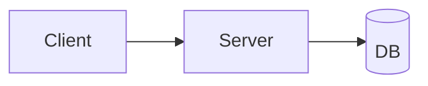

# 시스템 설계

> 상세 데이터보다 전체적인 흐름을 다룹니다.

## 1. 서비스 구조도
클라이언트, 서버, DB, 스토리지, 캐시 배치

```mermaid
flowchart LR
    Client --> Server --> DB[(DB)]
```

## 2. 인증 및 보안 전략
- 인증 방식:
- 토큰 관리:
- 보안 정책:

## 3. 인프라 및 배포 환경
- 배포 파이프라인:
- 파일 업로드 방식:
- 환경 설정:
